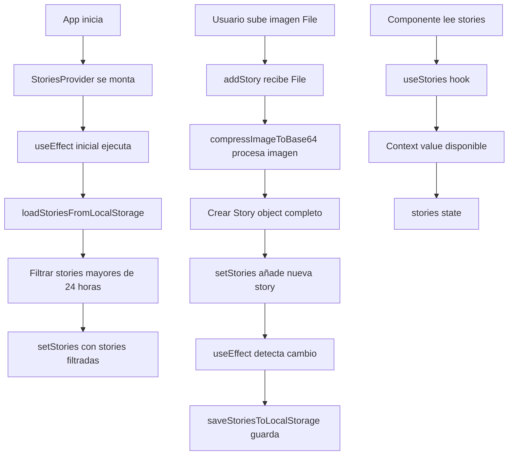

# Plan Fase 2 – Estado Global y Persistencia (Com

pleto)

## Objetivo

Crear el `StoriesContext` que gestione el estado global de las stories, las persista en `localStorage` y filtre automáticamente las que tengan más de 24 horas al cargar la aplicación.**Nota importante sobre múltiples stories:**

- Un usuario puede subir múltiples stories (varias imágenes).
- Todas las stories se almacenan en un array `Story[]` en orden cronológico.
- Cuando el usuario abre el visor (Fase 4), se mostrarán todas las stories en secuencia (1/3, 2/3, 3/3).
- Cada story tiene su propia barra de progreso.
- El temporizador avanza automáticamente cada 3 segundos, o el usuario puede navegar manualmente.

---

## 0. Conceptos Fundamentales: ¿Qué es el Context API de React?

### ¿Por qué necesitamos Context API?

**El Problema del "Prop Drilling":**

- Sin Context API, si quieres pasar datos desde `App.tsx` hasta un componente profundo como `StoryCircle`, tendrías que pasar props a través de cada nivel intermedio.
- Ejemplo problemático:
  ```javascript
          App → ComponenteA → ComponenteB → ComponenteC → StoryCircle
  ```


Tendrías que pasar `stories` y `addStory` como props en cada nivel, incluso si esos componentes intermedios no los usan.**La Solución: Context API**

- El Context API permite compartir estado y funciones entre componentes sin pasar props manualmente.
- Es perfecto para estado "global" como nuestra lista de historias.
- Los componentes que necesiten las stories simplemente usan el hook `useStories()` sin importar dónde estén en el árbol.

**Conceptos Clave:**

- **Context Object (`StoriesContext`)**: El objeto que creas con `React.createContext()`. Define la "forma" de los datos que compartirás.
- **Provider Component (`StoriesProvider`)**: Un componente que envuelve partes de tu app y "provee" el estado a sus hijos.
- **Custom Hook (`useStories`)**: Una función que facilita el acceso al Context desde cualquier componente.

---

## 1. Estructura del StoriesContext.tsx

### 1.1 Archivo a Crear

**Ubicación:** `src/context/StoriesContext.tsx`**Estructura del archivo:**El archivo tendrá **tres partes principales**:

1. **Imports necesarios**
2. **Definición del Context Object**
3. **Provider Component y Custom Hook**

---

### 1.2 Imports Necesarios

```typescript
import { createContext, useContext, useState, useEffect, ReactNode } from 'react';
import { Story } from '../types';
import { compressImageToBase64 } from '../services/imageServices';
```

**Explicación de cada import:**

- `createContext`: Para crear el objeto Context.
- `useContext`: Para consumir el Context (usado dentro del custom hook).
- `useState`: Para gestionar el estado `stories`.
- `useEffect`: Para cargar/guardar en localStorage y ejecutar efectos secundarios.
- `ReactNode`: Tipo para los `children` del Provider.

---

### 1.3 Definición del Context Object

**Diseño de la interfaz del Context Value:**

```typescript
interface StoriesContextValue {
  stories: Story[];
  addStory: (file: File) => Promise<void>;  // Recibe File, no Story
  removeStory?: (id: string) => void;       // Opcional para esta fase
  // Funciones opcionales para fases futuras:
  // currentStoryIndex?: number;
  // nextStory?: () => void;
  // prevStory?: () => void;
}
```

**Creación del Context:**

```typescript
const StoriesContext = createContext<StoriesContextValue | undefined>(undefined);
```

**¿Por qué `undefined` como valor por defecto?**

- Permite detectar si un componente está intentando usar el Context fuera del Provider.
- El custom hook `useStories` verificará esto y lanzará un error descriptivo.

---

## 2. Estado y Funciones dentro del StoriesProvider

### 2.1 Estado Principal

**Estado a gestionar:**

```typescript
const [stories, setStories] = useState<Story[]>([]);
```

**Inicialización:**

- Inicialmente será un array vacío `[]`.
- Se cargará desde `localStorage` en un `useEffect` al montar el componente.

**Consideraciones para navegación secuencial:**

- El array `stories` contiene todas las stories del usuario en orden cronológico.
- Las stories se ordenan por `timestamp` ascendente (más antigua primero, como Instagram).
- En la Fase 4, el `StoryViewer` usará un índice local (`currentStoryIndex`) para navegar entre stories.
- El Context solo gestiona el array completo; la navegación secuencial se maneja en el componente `StoryViewer`.
- No es necesario añadir estado de `currentStoryIndex` al Context, ya que solo se necesita mientras el visor está abierto.

---

### 2.2 Funciones Clave del Provider

#### `addStory(file: File): Promise<void>`

**Propósito:** Agregar una nueva story procesando un archivo de imagen.**Flujo completo:**

1. **Recibe:** Un `File` (la imagen cruda del `<input type="file">`).
2. **Procesa la imagen:**

- Llama a `compressImageToBase64(file)` del `imageService`.
- Esta función retorna una `Promise<string>` con el Base64.

3. **Crea el objeto Story completo:**
   ```typescript
               const newStory: Story = {
                 id: crypto.randomUUID(),           // Genera ID único
                 imageUrl: base64String,            // El Base64 del paso anterior
                 timestamp: Date.now(),              // Momento actual en milisegundos
                 duration: 3000                      // 3 segundos (valor por defecto)
               };
   ```

4. **Añade al estado:**
   ```typescript
               setStories(prevStories => [...prevStories, newStory]);
   ```

5. **Persistencia:** El `useEffect` con dependencia `[stories]` guardará automáticamente en `localStorage`.

**Consideraciones:**

- Es una función `async` porque `compressImageToBase64` retorna una Promise.
- Debes manejar errores si la compresión falla (usar `try/catch` o `.catch()`).

---

#### `removeStory(id: string): void`

**Propósito:** Eliminar una story específica por su `id`.**Lógica interna:**

```typescript
const removeStory = (id: string) => {
  setStories(prevStories => 
    prevStories.filter(story => story.id !== id)
  );
};
```

**Persistencia:** Se guarda automáticamente gracias al `useEffect` con dependencia `[stories]`.**Nota:** Esta función es opcional para la Fase 2, pero es útil tenerla desde el principio.---

#### `clearOldStories(): void` (función auxiliar privada)

**Propósito:** Filtrar y eliminar stories con más de 24 horas.**Lógica del cálculo:**

```typescript
const clearOldStories = () => {
  const now = Date.now();
  const twentyFourHoursInMs = 24 * 60 * 60 * 1000; // 86,400,000 ms
  
  setStories(prevStories => 
    prevStories.filter(story => {
      const storyAge = now - story.timestamp;
      return storyAge <= twentyFourHoursInMs; // Mantener solo las que tienen ≤ 24h
    })
  );
};
```

**Explicación del cálculo:**

- `Date.now()` retorna milisegundos desde el 1 de enero de 1970.
- `story.timestamp` también está en milisegundos (se guardó con `Date.now()`).
- `storyAge = now - story.timestamp` da la edad de la story en milisegundos.
- Si `storyAge > 24 * 60 * 60 * 1000`, la story tiene más de 24 horas y se elimina.

**Cuándo se ejecuta:**

- Al cargar la app (en el `useEffect` inicial, después de cargar desde localStorage).

---

## 3. Lógica de Persistencia con localStorage y useEffect

### 3.1 Funciones Auxiliares de localStorage

#### `loadStoriesFromLocalStorage(): Story[]`

**Propósito:** Leer stories guardadas al iniciar la app.**Implementación:**

```typescript
const loadStoriesFromLocalStorage = (): Story[] => {
  try {
    const stored = localStorage.getItem('stories');
    if (stored) {
      const parsed = JSON.parse(stored) as Story[];
      return Array.isArray(parsed) ? parsed : [];
    }
    return [];
  } catch (error) {
    console.error('Error al cargar stories desde localStorage:', error);
    return [];
  }
};
```

**Manejo de errores:**

- Si `localStorage.getItem` falla (navegador en modo privado, storage deshabilitado).
- Si `JSON.parse` falla (datos corruptos).
- Si el dato parseado no es un array.

**Retorno seguro:** Siempre retorna un array (vacío si hay error).---

#### `saveStoriesToLocalStorage(stories: Story[]): void`

**Propósito:** Guardar el array actual en `localStorage`.**Implementación:**

```typescript
const saveStoriesToLocalStorage = (stories: Story[]): void => {
  try {
    localStorage.setItem('stories', JSON.stringify(stories));
  } catch (error) {
    console.error('Error al guardar stories en localStorage:', error);
    // Opcional: mostrar notificación al usuario si localStorage está lleno
  }
};
```

**Manejo de errores:**

- `localStorage` puede fallar si está lleno (límite ~5-10MB según navegador).
- `JSON.stringify` puede fallar con objetos circulares (no debería pasar con `Story[]`).

---

### 3.2 useEffect para Carga Inicial

**Cuándo ejecutar:** Una sola vez al montar el componente.**Implementación:**

```typescript
useEffect(() => {
  // 1. Cargar desde localStorage
  const loadedStories = loadStoriesFromLocalStorage();
  
  // 2. Filtrar stories expiradas inmediatamente después de cargar
  const now = Date.now();
  const twentyFourHoursInMs = 24 * 60 * 60 * 1000;
  const filteredStories = loadedStories.filter(story => {
    const storyAge = now - story.timestamp;
    return storyAge <= twentyFourHoursInMs;
  });
  
  // 3. Establecer el estado inicial con las stories filtradas
  setStories(filteredStories);
  
  // 4. Si se filtraron stories, guardar el array filtrado
  if (filteredStories.length !== loadedStories.length) {
    saveStoriesToLocalStorage(filteredStories);
  }
}, []); // Array vacío = se ejecuta solo una vez al montar
```

**Explicación del array de dependencias vacío `[]`:**

- Sin dependencias significa que el efecto se ejecuta **solo una vez** cuando el componente se monta.
- Perfecto para la carga inicial.

---

### 3.3 useEffect para Guardado Automático

**Cuándo ejecutar:** Cada vez que el array `stories` cambie.**Implementación:**

```typescript
useEffect(() => {
  // Solo guardar si hay stories (evita guardar array vacío innecesariamente)
  if (stories.length > 0 || localStorage.getItem('stories') !== null) {
    saveStoriesToLocalStorage(stories);
  }
}, [stories]); // Se ejecuta cada vez que `stories` cambia
```

**Explicación de la condición:**

- `stories.length > 0`: Guarda si hay stories.
- `localStorage.getItem('stories') !== null`: También guarda si había stories antes (para limpiar localStorage cuando se eliminan todas).

**¿Por qué no guardar en `addStory` directamente?**

- Separación de responsabilidades: `addStory` solo modifica el estado.
- El `useEffect` se encarga automáticamente de la persistencia.
- Si añades más formas de modificar `stories` (ej: `removeStory`, `clearAll`), todas se guardarán automáticamente sin código adicional.

---

## 4. Provider Component y Custom Hook

### 4.1 StoriesProvider Component

**Estructura completa:**

```typescript
export const StoriesProvider = ({ children }: { children: ReactNode }) => {
  // 1. Estado
  const [stories, setStories] = useState<Story[]>([]);
  
  // 2. Funciones auxiliares (loadStoriesFromLocalStorage, saveStoriesToLocalStorage, clearOldStories)
  
  // 3. Funciones expuestas (addStory, removeStory)
  
  // 4. useEffect para carga inicial
  
  // 5. useEffect para guardado automático
  
  // 6. Valor del Context
  const value: StoriesContextValue = {
    stories,
    addStory,
    removeStory, // Opcional
  };
  
  // 7. Retornar el Provider
  return (
    <StoriesContext.Provider value={value}>
      {children}
    </StoriesContext.Provider>
  );
};
```

**Explicación del `children`:**

- `children` es todo lo que está dentro de `<StoriesProvider>...</StoriesProvider>`.
- El Provider "envuelve" esos componentes y les da acceso al Context.

---

### 4.2 Custom Hook `useStories`

**Implementación:**

```typescript
export const useStories = (): StoriesContextValue => {
  const context = useContext(StoriesContext);
  
  if (!context) {
    throw new Error('useStories must be used within a StoriesProvider');
  }
  
  return context;
};
```

**¿Por qué crear este hook?**

- **Seguridad:** Verifica que el componente esté dentro del Provider.
- **Conveniencia:** Los componentes solo llaman `useStories()` en lugar de `useContext(StoriesContext)`.
- **Mensaje de error claro:** Si alguien usa el hook fuera del Provider, obtiene un error descriptivo.

**Uso en componentes:**

```typescript
// En cualquier componente hijo del Provider
const { stories, addStory } = useStories();
```

---

## 5. Flujo de Datos Completo



---

## 6. Generación de IDs Únicos

### Opciones Disponibles

**Opción A: `crypto.randomUUID()` (Recomendada)**

```typescript
const id = crypto.randomUUID(); // Ejemplo: "550e8400-e29b-41d4-a716-446655440000"
```

- **Ventajas:** Estándar del navegador, muy único, sin dependencias.
- **Desventajas:** Requiere navegadores modernos (Chrome 92+, Firefox 95+, Safari 15.4+).
- **Compatibilidad:** Suficiente para proyectos modernos.

**Opción B: `Date.now().toString()`**

```typescript
const id = Date.now().toString(); // Ejemplo: "1704567890123"
```

- **Ventajas:** Funciona en todos los navegadores, muy simple.
- **Desventajas:** Menos único (dos uploads simultáneos podrían tener el mismo ID).

**Opción C: Combinación de timestamp + random**

```typescript
const id = `${Date.now()}-${Math.random().toString(36).substring(2, 9)}`;
```

- **Ventajas:** Balance entre unicidad y compatibilidad.
- **Desventajas:** Más código.

**Recomendación para este proyecto:** Usar `crypto.randomUUID()` si tu público objetivo usa navegadores modernos.---

## 7. Manejo de Errores

### Errores Potenciales

1. **localStorage no disponible:**

- Navegador en modo privado.
- Storage deshabilitado por el usuario.
- **Solución:** Usar `try/catch` y retornar array vacío.

2. **localStorage lleno:**

- Límite típico: ~5-10MB.
- **Solución:** Mostrar mensaje al usuario o implementar límite de stories.

3. **Error al comprimir imagen:**

- Archivo corrupto, formato no soportado.
- **Solución:** `try/catch` en `addStory` y mostrar error al usuario.

4. **Datos corruptos en localStorage:**

- JSON malformado.
- **Solución:** Validar con `Array.isArray()` y resetear si es necesario.

---

## 8. Orden de Implementación Detallado

### Paso 1: Funciones Auxiliares de localStorage

1. Implementar `loadStoriesFromLocalStorage()`.
2. Implementar `saveStoriesToLocalStorage()`.
3. **Prueba:** Guardar manualmente un array de prueba y verificar que se carga correctamente.

### Paso 2: Función de Filtrado

1. Implementar `clearOldStories()` o la lógica de filtrado dentro del `useEffect` inicial.
2. **Prueba:** Crear stories con timestamps antiguos (ej: `Date.now() - 25 * 60 * 60 * 1000`) y verificar que se filtran.

### Paso 3: Estado y Funciones del Context

1. Crear el estado `stories` con `useState<Story[]>([])`.
2. Implementar `addStory(file: File)` con manejo de errores.
3. Implementar `removeStory(id: string)` (opcional).
4. **Prueba:** Añadir una story y verificar que aparece en el estado.

### Paso 4: Provider y Hook

1. Crear `StoriesContext` con `createContext`.
2. Crear `StoriesProvider` component con todas las funciones.
3. Crear `useStories` custom hook.
4. **Prueba:** Usar `useStories` en un componente de prueba y verificar acceso al estado.

### Paso 5: Integración Completa

1. `useEffect` inicial para cargar y filtrar.
2. `useEffect` con dependencia `[stories]` para guardar automáticamente.
3. Conectar `addStory` con el flujo completo.
4. **Prueba:** Añadir stories, recargar la página, verificar persistencia y filtrado.

---

## 9. Archivos a Modificar/Crear

- **`src/context/StoriesContext.tsx`** - Crear desde cero con toda la lógica.
- **`src/types.ts`** - Ya tiene `Story` interface, no necesita cambios.
- **`src/App.tsx`** - Envolver la app con `<StoriesProvider>` (esto lo haremos en la Fase 3, pero puedes prepararlo mentalmente).

---

## 10. Consideraciones para Navegación Secuencial (Fases Futuras)

### 10.1 Cómo funcionará la navegación entre múltiples stories

**En la Fase 4 (StoryViewer):**

- El `StoryViewer` recibirá el array completo `stories` desde el Context.
- Gestionará localmente un estado `currentStoryIndex` (empezando en 0).
- Mostrará la story actual: `stories[currentStoryIndex]`.
- Renderizará múltiples barras de progreso según `stories.length`.
- Mostrará indicador visual del progreso (ej: "1/3", "2/3", "3/3").

**En la Fase 5 (Temporizadores y Gestos):**

- El temporizador avanzará automáticamente `currentStoryIndex` cada 3 segundos.
- Cuando `currentStoryIndex === stories.length - 1` y el temporizador termina, se cierra el visor.
- Los gestos (swipe/tap) modificarán `currentStoryIndex` manualmente.
- Cada vez que cambia `currentStoryIndex`, se reinicia el temporizador.

**Orden de las stories:**

- Las stories se ordenan por `timestamp` ascendente (más antigua primero).
- Esto asegura que cuando el usuario abre el visor, ve las stories en el orden en que las subió.

---

## 11. Preguntas de Verificación

Antes de empezar a implementar, asegúrate de entender:

1. ¿Por qué usamos Context API en lugar de pasar props?
2. ¿Cuál es la diferencia entre el Context Object y el Provider Component?
3. ¿Por qué `addStory` recibe un `File` y no un `Story`?
4. ¿Cuándo se ejecuta el `useEffect` de carga inicial? ¿Y el de guardado?
5. ¿Cómo calculas si una story tiene más de 24 horas?
6. ¿Qué pasa si `localStorage` está lleno o no disponible?
7. ¿Cómo se ordenarán las stories para la navegación secuencial? (Por timestamp ascendente)
8. ¿Dónde se gestionará el `currentStoryIndex` para navegar entre stories? (En el StoryViewer, no en el Context)
9. ¿Cómo se ordenarán las stories para la navegación secuencial? (Por timestamp ascendente)
10. ¿Dónde se gestionará el `currentStoryIndex` para navegar entre stories? (En el StoryViewer, no en el Context)

---

## Próximos Pasos

Una vez que tengas claro el diseño:

1. **Empieza por las funciones auxiliares** (`loadStoriesFromLocalStorage`, `saveStoriesToLocalStorage`).